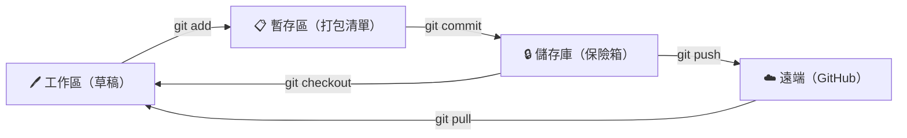
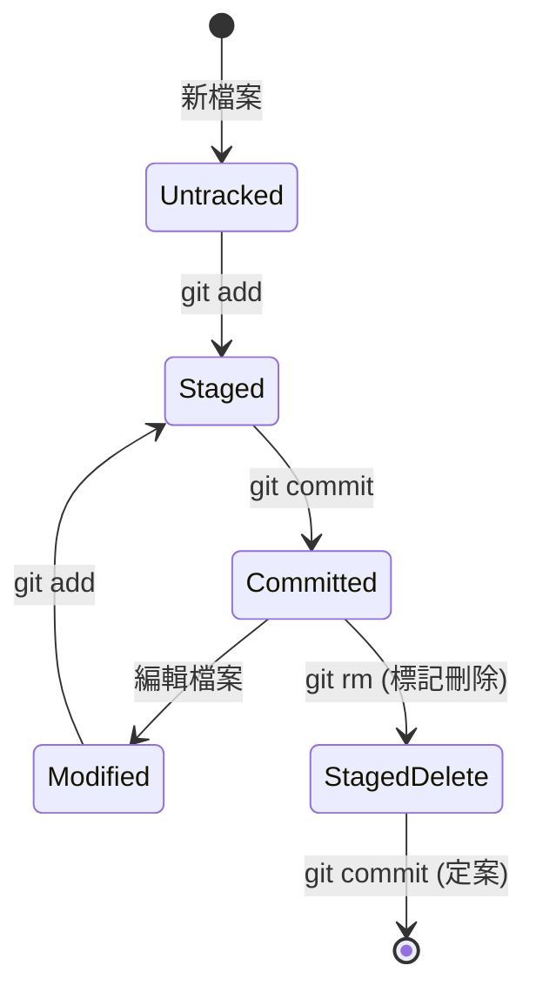
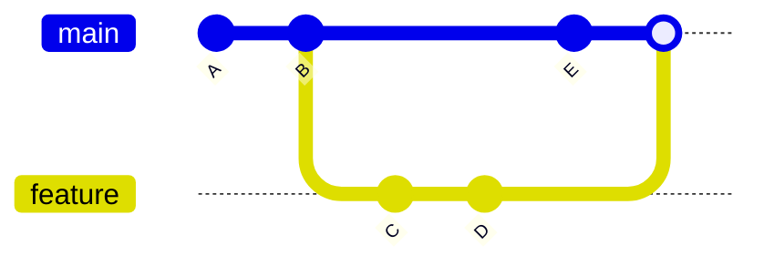

# Git 教學

**講者：** Allen
**目標：** 建立版本控制思維，學會核心存檔流程

---

<!-- _class: lead -->

# Part 1

## 觀念建立

> 先理解「為什麼」，再學「怎麼做」

---

# 為什麼需要 Git？
### 擺脫「最終版」的地獄

* **痛點**：`專案_最終版_真的最後一版_打死不改版.zip`
* **Git 的價值**：
  1. **版本追蹤**：誰在什麼時候改了什麼？
  2. **多人協作**：大家同時改檔案也不會互相覆蓋。
  3. **大膽實驗**：隨時回到過去，不怕寫壞程式碼。

---

# 版本控制的演進

| 世代 | 代表工具 | 特性 | 痛點 |
| :--- | :--- | :--- | :--- |
| 手動備份 | `.zip` 檔案 | 簡單 | 易混亂、無協作 |
| 集中式 (CVCS) | SVN, CVS | 有中央伺服器 | 斷網就不能工作 |
| **分散式 (DVCS)** | **Git**, Mercurial | 每人一份完整歷史 | 學習曲線稍陡 |

> Git 由 **Linus Torvalds** 在 2005 年為 Linux 核心開發而設計。

---

# Git 的設計哲學

1. **快**：所有操作在本地完成，不需要網路。
2. **完整性**：每個檔案、每次變更都用 SHA-1 雜湊驗證。
3. **快照而非差異**：Git 儲存的是「當下的完整狀態」，不是「改了哪幾行」。
4. **分支廉價**：開分支只是新增一個 41 bytes 的指標檔案。

```text
3f4a2b1c8d... ← 一個 commit 的身份證
```

---

# 核心概念：Git 的三個空間
### 理解這張圖，你就學會了 Git 的 80%



---

# 檔案的生命週期



* **Untracked（未追蹤）**：Git 還不認識它。
* **Modified（已修改）**：改過但還沒打包。
* **Staged（已暫存）**：放進打包清單，準備存檔。
* **Committed（已提交）**：正式進入歷史紀錄。
* **StagedDelete（待刪除）**：`git rm` 只是「標記要刪」，還要 `commit` 才真的從歷史中移除。

---

# Commit 是什麼？

每一個 Commit 是一次**完整的快照**，包含：

| 屬性 | 說明 |
| :--- | :--- |
| SHA-1 ID | 唯一識別碼，例如 `3f4a2b1c...` |
| 作者 / 時間 | 誰、什麼時候做的 |
| Commit 訊息 | 為什麼做這個變更 |
| 父 Commit | 指向上一個快照（形成歷史鏈） |
| 檔案快照 | 當下所有檔案的內容 |

> Commit 是 Git 的最小不可變單位，永不修改、只會新增。

---

# 分支的本質：只是一個指標



* `main`、`feature` 都只是「指向某個 Commit 的指標」。
* 開分支 = 新增一個指標 → **超快、超輕量**。
* 切換分支 = 移動 `HEAD` 指標。

---

# 📖 如何寫好 Commit 訊息？

* **壞榜樣**：`update`, `123`, `...`
* **好榜樣（Conventional Commits）**：
  * `feat: 新增登入功能`
  * `fix: 修復購物車金額計算錯誤`
  * `docs: 修改 README 說明文件`
  * `refactor: 重構訂單處理邏輯`
  * `test: 補上付款流程單元測試`

*原則：讓未來的自己（或同事）看懂你做了什麼。*

---

<!-- _class: lead -->

# Part 2

## Live Demo 實戰

> 跟著敲、跟著看、跟著錯

---

# 🛠️ Demo 1：建立你的第一個 Git 專案
### 目標：學會 `init` → `add` → `commit` 流程

**情境**：你要開始一個新專案，希望用 Git 追蹤所有變更。

**會用到的指令**：
- `git init`：初始化 Git 儲存庫。
- `git status`：**最強輔助！** 看現在是什麼狀態。
- `git add`：把檔案放進暫存區。
- `git commit`：正式存檔。
- `git log`：查看歷史紀錄。

---

# 🛠️ Demo 1 實作：第一次存檔

```bash
# 1. 建立專案資料夾並初始化
mkdir my-project && cd my-project
git init

# 2. 建立第一個檔案
echo "# 我的第一個專案" > README.md

# 3. 查看目前狀態（紅色 = 未追蹤）
git status

# 4. 加入暫存區（打包）
git add README.md

# 5. 再次查看狀態（綠色 = 已暫存）
git status

# 6. 正式存檔（提交到儲存庫）
git commit -m "feat: 初始化專案，新增 README"

# 7. 查看歷史紀錄
git log --oneline

# 8. 含作者、時間
git log --pretty=format:"%h %an %ad %s" --date=short
```

---

# 🛠️ Demo 1 延伸：修改後再存一版

```bash
# 修改檔案，模擬日常開發
echo "## 專案說明" >> README.md
echo "這是一個練習 Git 的示範專案。" >> README.md

# 查看修改了什麼（顯示行級差異）
git diff

# 加入暫存並存檔
git add README.md
git commit -m "docs: 補充專案說明內容"

# 看到兩筆紀錄了！
git log --oneline
```

> 💡 **觀察重點**：每次 `commit` 都會產生一個新的 SHA-1 ID。

---

# 🛠️ Demo 2：開分支做實驗
### 目標：學會 `branch` → `checkout` → `merge`

**情境**：主線 (`main`) 是穩定產品，你想開發新功能但不想影響主線。

**會用到的指令**：
- `git branch <名稱>`：建立分支。
- `git checkout <名稱>` 或 `git switch <名稱>`：切換分支。
- `git merge <名稱>`：把分支併回來。
- `git branch -d <名稱>`：刪除已合併的分支。

---

# 🛠️ Demo 2 實作：建立並切換分支

```bash
# 確認目前在 main 分支
git branch

# 開一條新分支（實驗室）
git branch feature/login

# 切換過去
git checkout feature/login

# 新增功能檔案
echo "登入功能" > login.txt
git add login.txt
git commit -m "feat: 新增登入功能模組"

# 切回主線，主線看不到 login.txt
git checkout main
ls
```

---

# 🛠️ Demo 2 延伸：合併分支回主線

```bash
# 確認在 main 分支上
git branch

# 把 feature/login 的成果合併進來
git merge feature/login

# 合併成功！main 現在也有 login.txt
ls
git log --oneline

# 分支任務完成，可以刪除
git branch -d feature/login
```

> 💡 **觀察重點**：合併後主線多出了 `hello.txt`，歷史紀錄也保留了分支的 commit。

---


# ⏪ Demo 3：後悔了怎麼辦？
### 目標：學會 `reset` 與 `revert` 的差異

**情境**：存錯了！兩種情況各有對應方式：

| 情況 | 適用指令 | 理由 |
| :--- | :--- | :--- |
| 還沒推送，本地修正 | `git reset` | 直接改寫歷史，不留痕跡 |
| 已推送遠端，多人協作 | `git revert` | 新增反轉 commit，歷史完整保留 |

---

# 🛠️ Demo 3 實作：`git reset`

```bash
# 建立三個 commit
echo "第一行：故事的開始" > story.txt && git add . && git commit -m "第一個 commit：故事的開始"
echo "第二行：中場出現轉折" >> story.txt && git add . && git commit -m "第二個 commit：加入轉折"
echo "第三行：結局（這行要還原）" >> story.txt && git add . && git commit -m "第三個 commit：加入結局"

git log --oneline
# f56c2df 第三個 commit：加入結局
# 2b10bbb 第二個 commit：加入轉折
# 42bcbe3 第一個 commit：故事的開始

# 撤銷最後一個 commit，但變更留在暫存區
git reset --soft HEAD~1

git log --oneline
# 第三個 commit 消失了！但 story.txt 內容不變
git status
# → Changes to be committed（變更還在暫存區）
```

> 💡 `--soft` 保留變更在暫存區；`--mixed`（預設）退回工作目錄；`--hard` 完全丟棄。

---

# 🛠️ Demo 3 實作：`git revert`

```bash
# 重新 commit 回來（模擬已推送的狀態）
git commit -m "第三個 commit：加入結局"

git log --oneline
# 65b4961 第三個 commit：加入結局
# 2b10bbb 第二個 commit：加入轉折
# 42bcbe3 第一個 commit：故事的開始

# 反轉最新的 commit（建立一個新的「反轉 commit」）
git revert HEAD --no-edit

git log --oneline
# d760d52 Revert "第三個 commit：加入結局"  ← 新增的
# 65b4961 第三個 commit：加入結局            ← 原本的還在
# 2b10bbb 第二個 commit：加入轉折
# 42bcbe3 第一個 commit：故事的開始

cat story.txt
# 第一行：故事的開始
# 第二行：中場出現轉折  ← 第三行被安全移除
```

> 💡 `revert` 不改寫歷史，適合已推送到遠端的 commit，多人協作不會衝突。

---

# ☁️ Demo 4：推上雲端 GitHub
### 目標：把本地專案備份到遠端

```bash
# 1. 在 GitHub 建立空的 repo（網頁操作）

# 2. 連結遠端
git remote add origin https://github.com/你的帳號/my-project.git

# 3. 推送（第一次要加 -u 建立追蹤關係）
git push -u origin main

# 4. 之後同事改了東西，拉下來
git pull
```

> 💡 `-u` 會記住「main → origin/main」的對應，下次 `git push` 不用再打分支名。

---

# 🎯 Live Demo 總結

| Demo | 學到了什麼 | 關鍵指令 |
| :--- | :--- | :--- |
| Demo 1 | 存檔基本流程 | `init` → `add` → `commit` |
| Demo 2 | 分支開發與合併 | `branch` → `checkout` → `merge` |
| Demo 3 | 本地修正錯誤 | `reset` / `revert` |
| Demo 4 | 推上雲端備份協作 | `remote add` → `push` → `pull` |

---

# 💡 關鍵筆記 (Cheat Sheet)

| 動作 | 指令 |
| :--- | :--- |
| 初始化 | `git init` |
| 查看狀態 | `git status` |
| 查看差異 | `git diff` |
| 加入暫存 | `git add .` |
| 正式存檔 | `git commit -m "msg"` |
| 查看紀錄 | `git log --oneline` |
| 開/切分支 | `git checkout -b <name>` |
| 合併分支 | `git merge <name>` |
| 推送雲端 | `git push` |


# 💡 救命區
| 情況 | 指令 |
| :--- | :--- |
| **Commit 訊息寫錯了** | `git commit --amend` |
| **剛 add 的檔案想撤回** | `git restore --staged <file>` |
| **剛改爛的檔案想還原** | `git restore <file>` |
| **想找回被刪掉的 commit** | `git reflog` |
| **分支太多想看圖解** | `git log --oneline --graph --all` |

---
